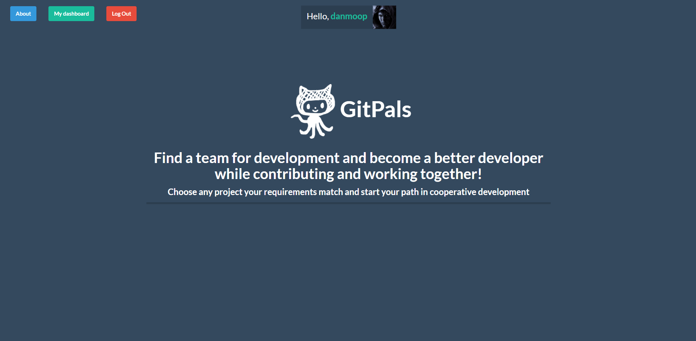
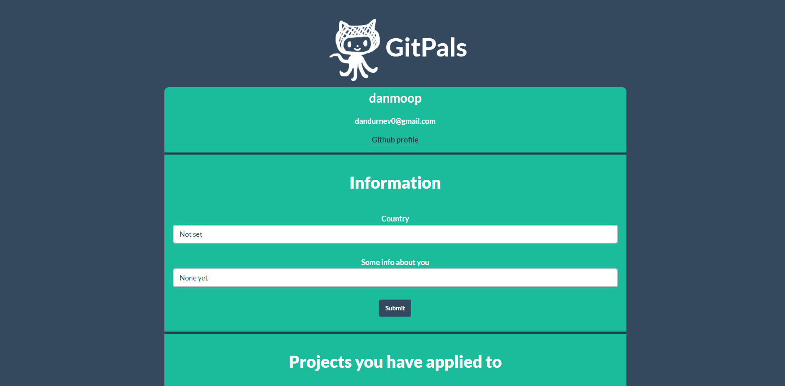
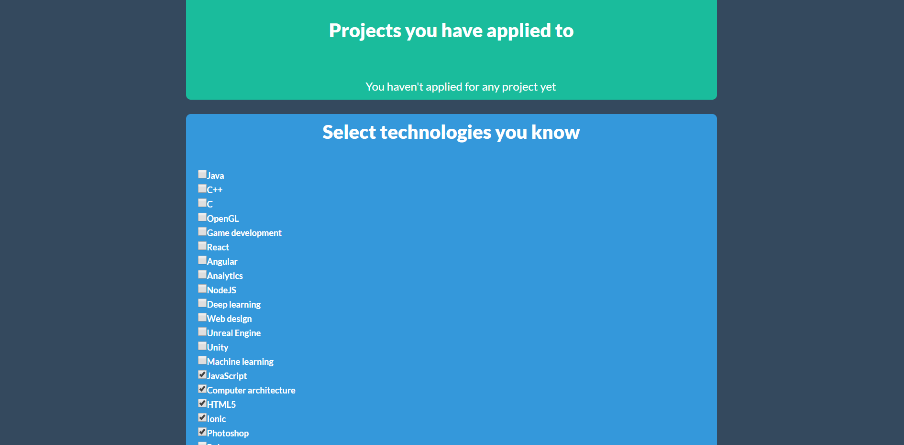
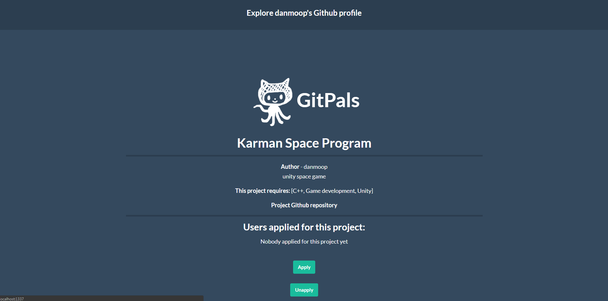
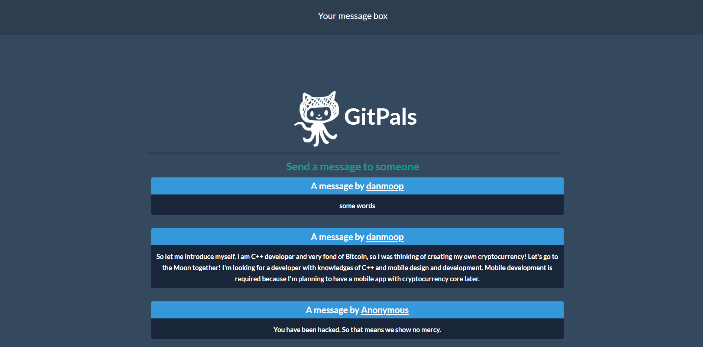

# GitPals
Application for finding people to work together with on different projects
[Open GitPals app](https://gitpals.herokuapp.com/) (it may take a while because of free hosting)

This project uses **Java, Spring, MongoDB**

<!--  -->

# Contributing:
Thank you for deciding to contribute! Download GitPals to your PC. You need to have MongoDB installed on your pc.
Open project in any IDE (I use Intellij IDEA). Then open Console Prompt and type in: mongod --dbpath=path_to_db (for example: mongod --dbpath=C:\GitPals\DB). 

[Video Guide](https://youtu.be/JbvxJyXmOEM)

**address - localhost:1337**

**MongoDB port - default 27017**

**Until you don't run mongo database, web page will return error**

Executing file - GitPals/src/main/java/com/moople/gitpals/MainApplication.java

**Controller folder** is main folder. Controllers execute all the functions (register user, add project, delete etc.)

**Service folder** contains just 2 files. That files save data to Mongo Database

**Model folder** contains files that have getter and setters (User Model, Project, etc.)
