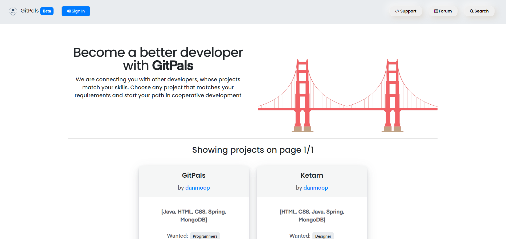
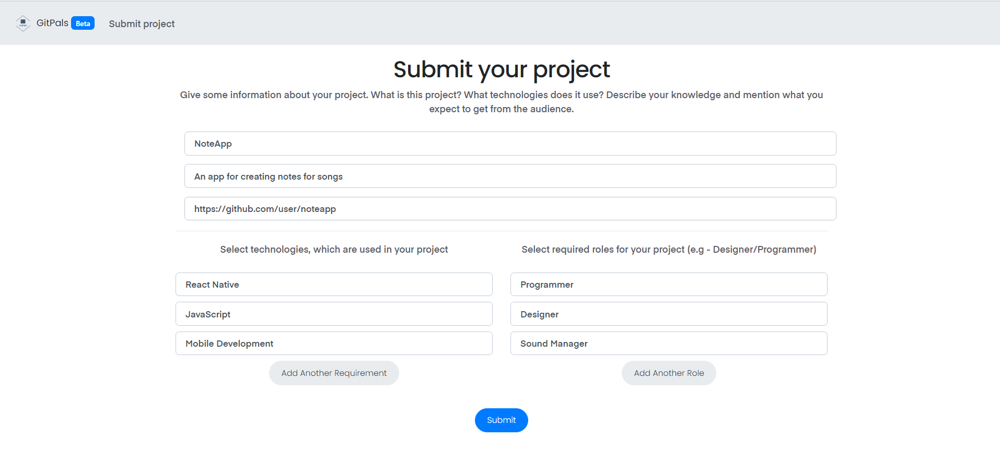

# GitPals

[Open GitPals app](https://www.gitpals.com/)

This project uses:
1. Java (Spring Framework, Thymeleaf for template rendering on a webiste, REST API used for a GitPals Mobile App)
2. HTML / CSS (Shards UI Kit)
3. MongoDB as a database

Check-list
- [x] Adding/deleting projects
- [x] Filling in your profile
- [x] Applying to projects
- [x] Writing/editing/removing comments
- [x] Forum (like a discussion board)
- [x] Creating roles for your projects (like Designer/Programmer, so people would know who you are looking for)
- [x] Searching 
- [x] Bootstrap Design (Shards UI KIT)
- [x] Realtime messaging among users
- [x] REST API
- [ ] Mobile App **[(IN PROGRESS: Ionic)](https://github.com/danmoop/GitPalsMobile)**

The rest of images

# Contributing:
Thank you for deciding to contribute! Download GitPals to your PC. You need to have MongoDB installed on your pc.
Open project in any IDE (I use Intellij IDEA). Then open Terminal/Console Prompt and type in: mongod --dbpath=path_to_db (for example: mongod --dbpath=C:\GitPals\DB). 

**[A Complete Guide to building the project on your computer](https://github.com/danmoop/GitPals/wiki/How-to-compile-this-project-on-your-computer%3F)**

**default address - localhost:1337**

**default MongoDB port - 27017**

**Unless you run mongo database, web page will return error**

**Executing file - GitPals/src/main/java/com/moople/gitpals/MainApplication.java**

**Service folder** contains classes that act as a logic part of the project. Service classes manipulate with the database and user's input, therefore, services execute such operations as publishing your project, writing comments, filling information about yourself in the dashboard, searching, etc. Both Web version and API use services to access the database.

**Controller folder** contains files that connects user's requests with the service files. For instance, user sends a request to get a list of projects with specific requirement (like C++ or Java), therefore, controller class will request service class to give the user that information. Again, service files do all the heavy business, controller simply tells service what exactly the user wants.

**Model folder** contains files that have information about each object (document schemas), like User, Project, Comment, Notification, etc. Each of those files describe themselves (like User class has fields like username, list of created projects and so on. Same procedure is true for each class located in this folder)
